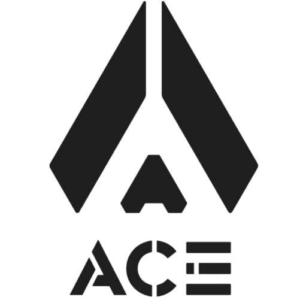

# ACE战队 RoboMaster26赛季编码端



## 编码端使用方法

一、运行环境

Ubuntu 22.04、ROS2 Humble

二、编译和运行程序


```sh
colcon build
. install/setup.bash
ros2 launch bring_up lob_shot.launch.py
```

## 声明

1.本次开源项目出自东莞理工学院ACE战队，作品仅用于技术交流，未经作者允许，不得作任何商业用途。

2.本次开源文件的最终解释权归东莞理工学院ACE战队所有。

3.开源目的在于加强参赛队之间交流，有助于提高自身和其他参赛队的水平。
